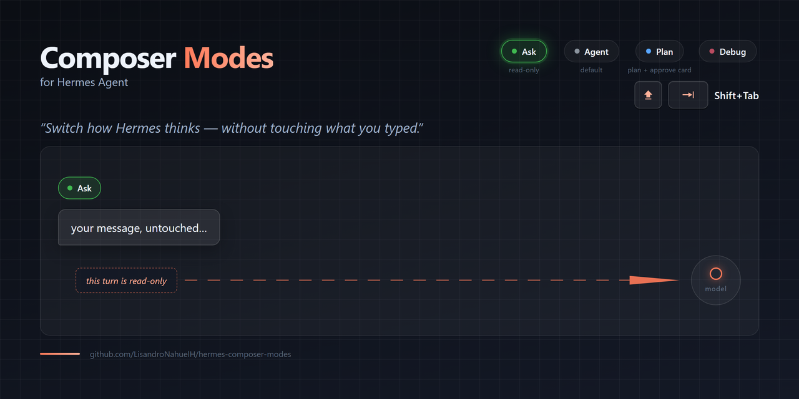

<div align="center">



# Composer Modes for Hermes Agent

**Switch how Hermes thinks — without touching what you typed.**

Four composer modes, one keystroke each. The mode's operating note reaches the
model, never your bubble, your transcript, or your session titles.

`License: MIT` · `Platform: Windows (v1)` · `Version: 12.2.0` · `Plugin + core seam + installer`

</div>

---

## What it is

Composer Modes adds a mode selector to the Hermes desktop composer:

| Mode | Color | What it does |
|---|---|---|
| **Ask** | green | Read-only turn. The agent may read files and inspect, but must not change anything — and always closes with *"Estoy en modo Ask, solo puedo responder…"* when asked for an action. |
| **Agent** | neutral | Full toolset, the default. No note travels; nothing changes about a normal turn. |
| **Plan** | blue | Planning only. The agent saves a plan under `.hermes/plans/` and ends with an inline **Plan card** (Implement / Modify / Read plan / Copy path). |
| **Debug** | red | A guided debugging loop: instrument → numbered reproduction steps → *Mark as fixed* cleans the instrumentation up. |

The interface part is the easy half. The hard half is **how the mode reaches the
model without polluting your conversation** — and that is what this repo ships.

## The idea: a hidden note channel

Every mode attaches a short operating note ("this turn is read-only", "plan rules",
"debug loop contract") to the turn. Composer Modes delivers that note through a
**per-turn sidecar channel**: it merges into the model-facing content only
(`api_content`), one-shot. Your visible message, the durable transcript row, the
sidebar preview and the auto-title stay exactly what you typed.

```
composer ── mid-cycle ──▶ plugin (mode + note)
   │                          │
   │                          ├─ new builds: note rides the submit frame (engine-side seam)
   │                          └─ stock builds: session.note.stage (one-shot, TTL 30 s)
   ▼
prompt.submit ── note ──▶ gateway ──▶ api_content (model)      content (you, untouched)
```

## What gets installed

| # | Piece | What it is | Where it lands |
|---|---|---|---|
| 1 | **Plugin** | `plugin/composer-modes/plugin.js` — the modes, cards, probes | `%LOCALAPPDATA%\hermes\desktop-plugins\composer-modes\` |
| 2 | **Core seam** | `core-patch/` — a transactional, anchored patch: note param, `session.note.stage`, ask sandwich, pristine titles | your `hermes-agent` checkout (5 files, reversible) |
| 3 | **Installer** | `install/install.ps1` — preflight, sha256 gate, backup + manifest, verify gate, detached restart | runs from this repo |

Plus two guardians, so it keeps working while you forget it exists:

| Guardian | Watches | Repairs |
|---|---|---|
| **Windows task** `HermesComposerModesEnsure` | Hermes updates that reset the checkout | re-runs the installer (`-Repair`, logon + every 6 h) |
| **Hermes cronjob** (`install/cronjob.md`) | this repo's releases | pulls the new version, re-runs the installer, sends you one line |

## Quick start — one prompt

1. Open Hermes (desktop).
2. Give your agent this repo's link.
3. Say: **"Install and configure everything in this repo."**

Your agent reads [`AGENTS.md`](AGENTS.md) — the runbook written for exactly that —
installs the three pieces, creates the Windows task, sets the update cronjob, and
reports a verification checklist. Then you forget about it.

Prefer doing it by hand? [`AGENTS.md`](AGENTS.md) → *Manual path* has the same steps
as copy-paste commands.

## Requirements

- Windows 10/11 (v1 — macOS/Linux: see the stub in `install/install.sh`, do not hand-patch).
- Hermes Agent with the desktop app, and a `hermes-agent` checkout on disk.
- Git (the installer reads the checkout; the cronjob pulls updates).
- An agent with terminal access (the whole point: it does the work).

## Security & trust

You are about to let a repo patch your Hermes. That deserves plain answers:

- **Exactly 5 core files are touched** (listed in [`docs/architecture.md`](docs/architecture.md));
  everything else is new files under your Hermes home.
- **Every write is reversible**: per-file backups (`.bak-<stamp>-<rand>`, never
  overwritten), a `composer-modes-patch-manifest.json` with before/after sha256,
  and `install/uninstall.ps1` that verifies hashes before restoring.
- **All-or-nothing**: the patcher verifies every anchor before the first write and
  re-verifies after the last one; a failure rolls everything back and exits non-zero.
  It never leaves a half-patched core. Upstream drift ⇒ loud failure, no guessing.
- **Pinned plugin**: the copy is gated by the sha256 published in `versions.json`.
- **Audit yourself**:

  ```powershell
  Get-Content <checkout>\composer-modes-patch-manifest.json   # what changed, hashes, backups
  git -C <checkout> diff                                       # see every patched line
  Get-Content $env:LOCALAPPDATA\hermes\composer-modes\install.log   # every install run
  ```

## Limits (honest ones)

- **Windows-only v1.** No macOS/Linux installer ships today; the stub tells agents to stop.
- **Hermes updates reset the checkout** — this is precisely why the Windows task
  re-applies the patch. If an update lands while the task is off, run `install.ps1` once.
- **Perfect per-entry queue freeze** (a queued message keeps the mode it had when
  queued, even if you switch modes meanwhile) rides the desktop-side seam that
  ships with the upstream PR. On stock builds the staged-note channel covers the
  normal path (single sends and the busy queue carry).
- **The note is an instruction to the model, not a hard sandbox.** Ask mode is
  enforced by a strict operating note (and the mandated closing line), not by
  tool-gating in the core.

## Uninstall

```powershell
powershell -NoProfile -ExecutionPolicy Bypass -File install\uninstall.ps1
```

Hash-verified restore of the 5 files, plugin removal (a copy is kept under
`%LOCALAPPDATA%\hermes\composer-modes\`), tasks deleted, backend restarted.

## Documentation

| Doc | For |
|---|---|
| [`AGENTS.md`](AGENTS.md) | the installing agent — runbook, verification, failure protocol |
| [`docs/architecture.md`](docs/architecture.md) | how the channel works, file map, size formulas |
| [`docs/limits.md`](docs/limits.md) | what is guaranteed, and where the edges are |
| [`docs/troubleshooting.md`](docs/troubleshooting.md) | probes, DB recipe, drift recovery |
| [`install/cronjob.md`](install/cronjob.md) | the update cronjob, ready to paste |

## Alternative: the upstream PR

The desktop-side seam (draft note/mode plumbing + queue freeze) is proposed
upstream in `NousResearch/hermes-agent` — if it merges, stock builds get the
frame natively and this repo's installer simply skips what is already there
(the patcher is idempotent). Until then, the staged-note channel is the bridge.

## Credits

Built by [@LisandroNahuelH](https://github.com/LisandroNahuelH) with the Hermes
Agent desktop plugin SDK. MIT licensed — use it, fork it, ship it.
